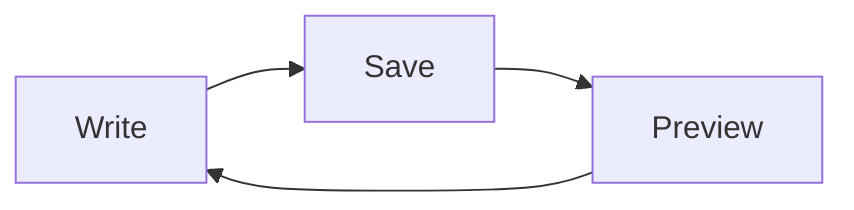

# Your words, in Markdown.

Keep writing in your editor. **Markup Preview** follows along when you save.
The original Org heading icon stays, a nod to where this reader began.

## Make yourself at home

Open `.md`, `.markdown`, and `.org` files in the same window. Each tab keeps
its search, source view, and reading position.

- [x] Open a notebook
- [x] Keep your favorite editor
- [ ] Write something worth keeping

| Write | Read |
| :--- | :--- |
| `# Heading` | Navigate with the outline |
| A saved change | See an updated preview |
| A local link | Open another document in a tab |

Try the [Org notebook](welcome.org::#welcome), or jump to
[code and diagrams](#code-and-diagrams). Both formats belong here.

## Code and diagrams

Code is highlighted offline. It never executes.

```javascript
const notebook = { format: "Markdown", live: true };
console.log(notebook);
```



## A little more Markdown

Use **bold**, *italic*, ~~a change of mind~~, or `inline code`.
Reference links work too: [read the Markdown guide][guide].

> The file is yours. The editor is your choice.

Local images use `` or reference definitions.
Remote images remain links. HTML stays literal, and your documents cannot
fetch network resources.[^local]

[guide]: https://commonmark.org/help/
[^local]: Clicking a web link opens your browser. Local document links stay in the app.
